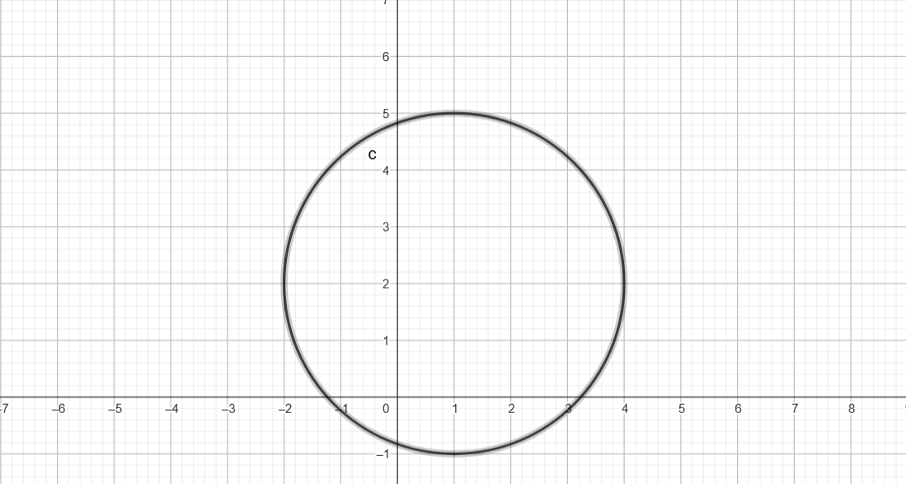
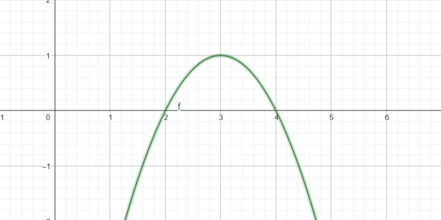
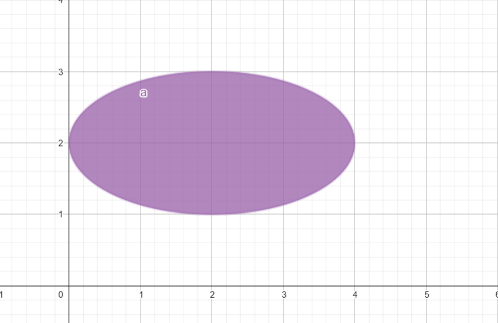
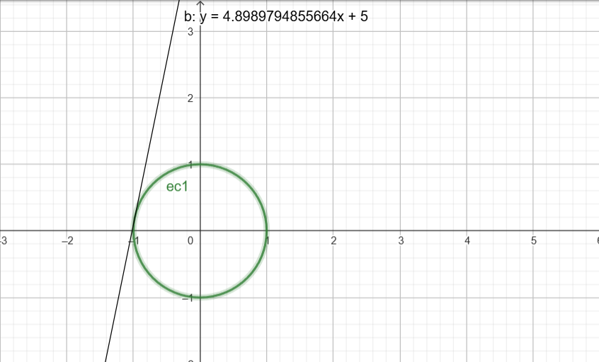
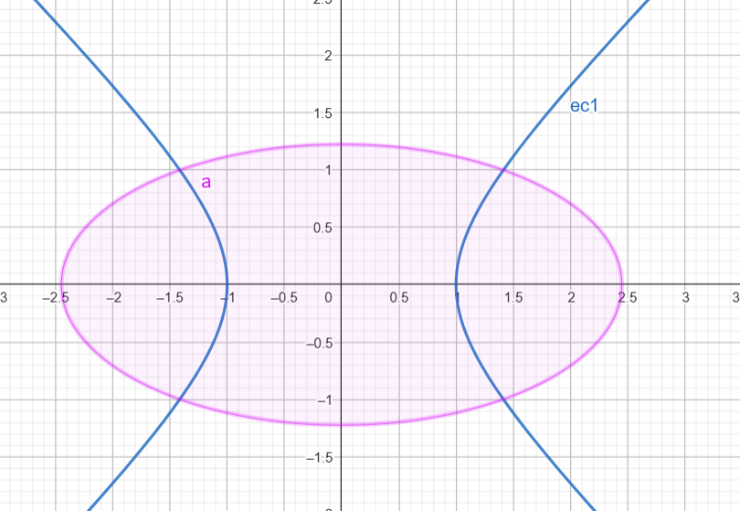
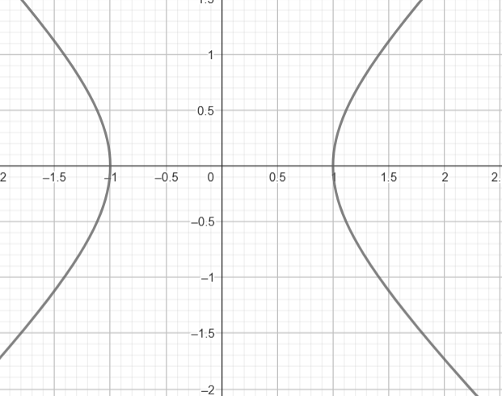

## Find the equation of a circle with center at point A(1,2) and radius r=3.

The general equation of a circle is given by: $(x-h)^2+(y-k)^2=r^2$
 
Here, h=1, k=2, and r=3. Substituting these values: $(x-1)^2+(y-2)^2=9$

## Find the equation of a parabola intersecting the Ox-axis at points x=2, x=4, and passing through point (3,1).

The general form of a parabola passing through roots x=r1 and x=r2 is: 

y=a(x−r1)(x-r2).

 
Here, r1=2, r2=4. To find a, use the point (3,1):

1=a(3−2)(3−4)⟹a=−1

The equation becomes:

y=−(x−2)(x−4)

## Find the center of the ellipse with the equation $x^2+4y^2-4x-16y+16=0$

The equation of the ellipse can be rewritten in standard form by completing the square. 

For x-terms: $(x^2-4x)→(x−2)^2-4$

For y-terms: $(4y^2-16y)→4((y−2)^2−4)$

Substituting these into the equation: $(x−2)^2 −4+4((y−2)^2-4)+16=0$

Simplify:

$(x−2) ^2+4(y-2)^2=4$

The center of the ellipse is (2,2).

## Find the slope (m>0) of the line y=mx−5 that is tangent to the circle $x^2+y^2=1$

The condition for tangency is that the discriminant of the quadratic equation formed after substitution equals zero.

Substitute y=mx−5 into  $x^2+y^2=1$

Solve for the discriminant.

$Discriminant=4m^2-96=0$

Solve for m:
$m=\sqrt{24}$

 

## Find the intersection points of the hyperbola $x^2-y^2=1$ with the ellipse $x^2+4y^2=6$

The equations are:

$x^2-y^2=1$
$x^2+4y^2=6$

Solve the system of equations:

$x^2=y^2+1$ (from the hyperbola)

Substitute into the ellipse equation:

$(y^2+1)+4y^2=6 ⟹ 5y^2=5 ⟹ y^2=1  $

Find x and y:

y=±1,x=± 2
 
The intersection points are 

(± 2,±1).

## For the given hyperbola $x^2-y^2=1$, find the distance between its branches.

The distance between the branches at a given y=k is:

$Distance= 2(\sqrt{1+k^2})$

 
