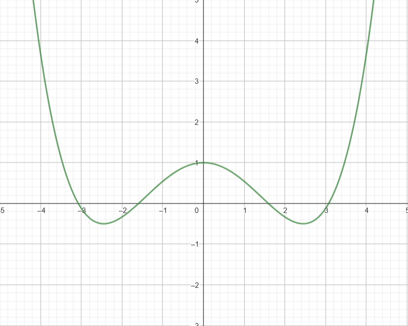
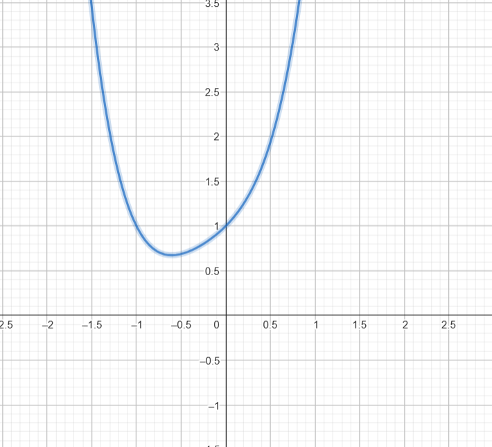
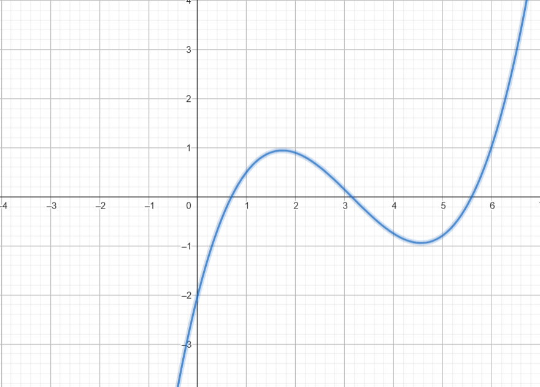

## 23. Taylor Series

# 1. **Find the Taylor series and visualize obtained functions in Geogebra**:

### For $( f(x) = cos(x))$ around $(x = 0)$  up to the 4th degree:
   The Taylor series expansion is:

$f (a) + frac{f'(a)}{1!} \cdot (x - a) + \frac{f''(a)}{2!} \cdot (x -a)^2$

Now, we substitue and give the solutions:
$(f(x) = cos(x))$ around $(x = 0)$:

- $f(0) = cos(0) = 1$ 
- $f'(x) = -sin(x) -> f'(0) = 0$ 
- $f''(x) = -cos(x) -> f''(0) = -1$ 
- $f'''(x) = sin(x) -> f'''(0) = 0$
- $f^{(4)}(x) = cos(x) -> f^{(4)}(0) = 1$ 

- Expansion substituting in the Taylor formula: 

$cos(0) + \frac{-sin(0)}{1!} \cdot x + \frac{-cos(0)}{2!} \cdot (x)^2 + \frac{sin(0)}{3!} \cdot (x)^3 + \frac{cos(0)}{4!} \cdot (x)^4$

As a result, $(1 - \frac{x^2}{2} + \frac{x^4}{24})$

  
### For $(h(x) = \frac{1}{1-x})$ around $(x = 0)$ up to the 4th degree:
   The Taylor series expansion is:

$f(a) + \frac{f'(a)}{1!} \cdot (x - a) + \frac{f''(a)}{2!} \cdot (x -a)^2$
  
As the function is already in the form of a geometric series, we didn't have to operate as before

$h(x) = \frac{1}{1-x} \approx 1 + x + x^2 + x^3 + x^4$

   
### For $( g(x) = sin(x))$ around $(x = \pi)$ up to the 4th degree:
   The Taylor series expansion is:
   
$g(x) = -((x-\pi) - \frac{(x-\pi)^3}{3!}) = -(x-\pi) + \frac{(x-\pi)^3}{6}$

- Expand around x=0 adding the t: $(x = t + \pi) = (sin(t+ \pi) = -sin(t))$ 
- Now, we find the Taylor Series of $-sin(t)$ around $t=0$: $( -(t - \frac{t^3}{3!}))$
- Then, we substitute $t= (x - \pi)$:  $-(x - \pi) + \frac{(x - \pi)^3}{6}$

# 2. **Find a tangent line** $( y = f'(x_0) (x-x_0) + f(x_0))$ **to the function** $(f(x) = e^{\sin(x)})$ **at** $(x_0 = \pi)$:

First, compute $(f'(x))$:

-We find the derivative: 

$f(x) = e^{\sin(x)}$ -> 
$f'(x) = e^{\sin(x)} \cos(x)$

Now, evaluate at $(x_0 = \pi)$:
   
$f(\pi) = e^{\sin(\pi)} = e^0 = 1$ -> 
$f'(\pi) = e^{\sin(\pi)} \cos(\pi) = 1 \cdot (-1) = -1$

   As a result, we have that the tangent line is:

$f'(\pi) \cdot (x-\pi) + f (\pi)$ -> 
$y = -1 \cdot (x - \pi) + 1 = -x + \pi + 1$

