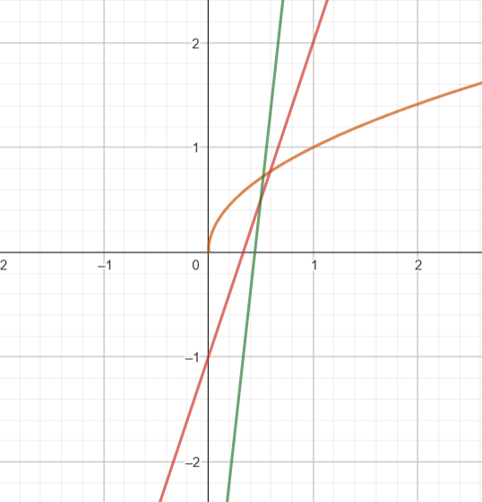

## 18. Functions

### 1. Draw in a single Geogebra notebook the following functions:
- $f(x) = x^2$
- $g(x) = \sqrt{x}$
- $h(x) = \frac{1}{x}$
- $j(x) = \sin(x)$

Find the values of all the above functions at $x = 2$.  

- $f(2) = 2^2 = 4$  
- $g(2) = \sqrt{2}$ 
- $h(2) = \frac{1}{2}$
- $j(2) = \sin(2)$ 

### 2. Let $f(x) = 3x - 1$ and $g(x) = \sqrt{x}$. Find:
- $f(g(x)) = 3\sqrt{x} - 1$

- $g(f(x)) = \sqrt{3x - 1}$

- $f(f(x)) = 3(3x - 1) - 1 = 9x - 4$

- $g(g(x)) = \sqrt{\sqrt{x}} = x^{1/4}$

### 3. Let $f(x) = e^x$ and $g(x) = \ln(x)$. Check $f(g(x))$ and $g(f(x))$.

- $f(g(x)) = e^{\ln(x)} = x$
- $g(f(x)) = g(e^x) = \ln(e^x) = x$

We can tell that the functions $f(x)$ and $g(x)$ are inverses of each other.

### 4. We have function $f = \{(1,7), (2,9), (3,11)\}$.  
**Inverse function**:  
f^{-1} = \{(7,1), (9,2), (11,3)\}

### 5. We have function $f = \{(1,7), (2,7), (3,11)\}$.  
**Inverse function**: 
 
The inverse doesn't exist since the $y$-value $7$ is repeated for two different $x$-values and that it's not possible

### 6. We have function $f(x) = x - 1$.  
**Inverse function**:  

x = y - 1 --> f^{-1}(x) = x + 1

